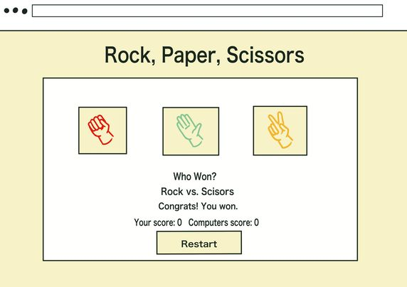
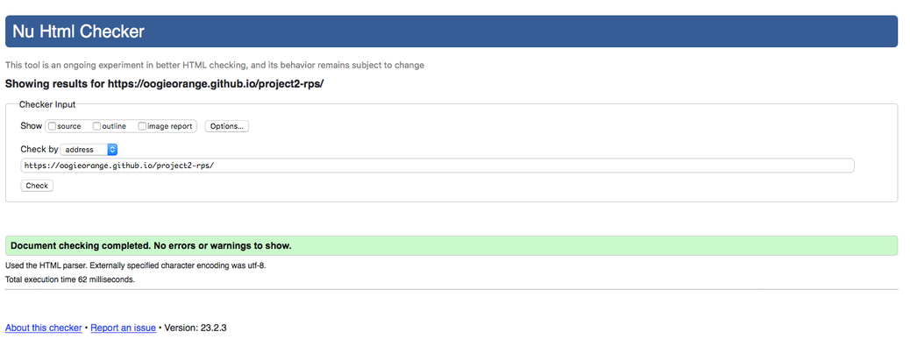
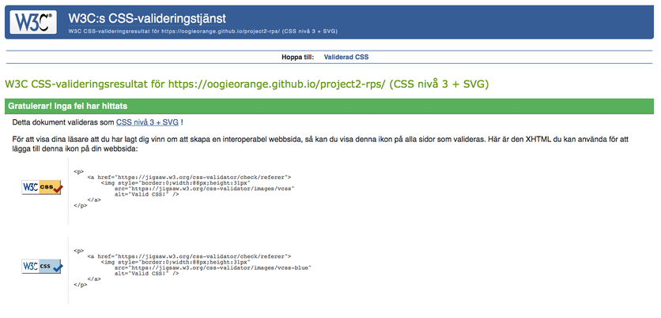
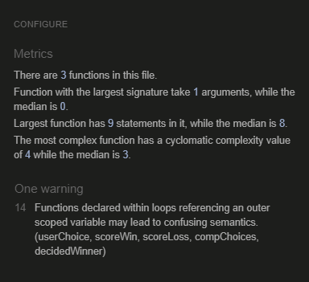
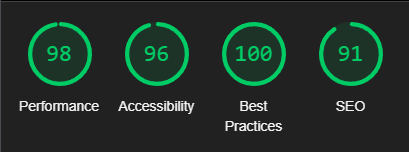

# Rock, Paper, Scissors

A perfect game to occupy ones atention when traveling or simply taking a quick break. 

Rock, paper, scissors is a basic webpage displaying a playable version of the game by the same name. It registers the users choice and match it against a randomly generated oponents choice. The score of the user and computer is recorded in a tally and the user can choose to continue playing indefinitely or to reset the score count. 

 

[LIVE SITE HERE](https://oogieorange.github.io/project2-rps/)

 

## Features
---

 

### Header

Displays that the purpose of the webpage is the game with corresponding name.

  

### Rules

Introduces how the game works for the user

 

### Option Buttons

Displays the options the user can choose between and registers their choice.

 

### Winner Display

Shows both parties choices and who won the round.

 

### Score Display

Holds the tally of how many times each of the parties has won.

 

### Reset Button

Resets the tally scores. So the user can choose to start over.

 

## Wireframe

---

The wireframe for the webpage. Certain other elements were added when coding the page.

 

## Technology
---

 

- HTML5
- CSS3
- JavaScript
- [Google Fonts](https://fonts.google.com/),   Was used to import the 'Fredoka One' and 'Quicksand' font familys into the connected css stylesheet.
- [Am I Responsive](https://ui.dev/amiresponsive),   Was used for checking responsiveness.
- [ClipStudios],   Was used to create the wireframe.
- Git,   Was used to commit through Gitpod repository and push code to GitHub.
- [GitHub](https://github.com/),   Was used to facilitate my project and to deploy it.
- [W3C Validator](https://validator.w3.org/#validate_by_uri), [W3C jigsaw CSS validator](https://jigsaw.w3.org/css-validator/) and [JSHint](https://jshint.com/),   Was used to validate all the code.

 

## Testing
---

 

### Function
All buttons on the page have been tested and all hover styling have been tested and execute intended purpose.

 

### Validation
The websites code has been tested and validated through W3C Validator, W3C jigsaw CSS validator, JSHint and LightHouse. The result is shown bellow through screenshots.

### W3C Validator

 

### W3C jigsaw CSS validator

 

### JSHint

 

### Lighthouse

 

## Browser Testing
---

 

### Chrome Dev Tools

The webpage containes media queries and are responsive down to a screen width of 320px. Above a screen width of 1300px, the content will retain it's width of 60rem (at it's widest) and center itself on the screen.

 

### Modzilla Firefox

- MacBook Air 12"

 

### Safari

- MacBook Air 12"/13"
- IPhone 11

 

### Chrome

- Desktop
- MacBook Air 12"/13"
- IPhone 11

 

### Microsoft Edge

- Desktop

  

## Found and Fixed Bugs
---

 

 When choosing to reset the game, the tally count would display 0-0 untill someone won a game. Now this is supposed to happen. But when the first new game was won, the tally for the winner would continue the count from the score preceding the reset.

 This was fixed by simply adding the "scoreWin" and "scoreLoss" variables (the score counting variables) to the reset button respons. 

 

## Deployment
---

 

1. Open GitHub repository and open the settings tab
2. From settings navigate to pages tab
3. Under branch, select the main branch through the dropdown menu
4. Once selected and saved, the page will be refreshed (in case of nothing happening wait for a couple minutes and refresh page manually)
5. The refreshed page will show a detailed ribbon containing the website link and indicate a successful deployment.

 

## Credits
---
