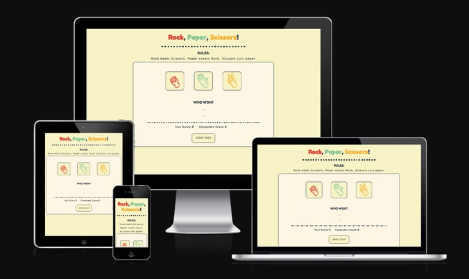

# Rock, Paper, Scissors

A perfect game to occupy ones atention when traveling or simply taking a quick break. 

Rock, paper, scissors is a basic webpage displaying a playable version of the game by the same name. It registers the users choice and match it against a randomly generated oponents choice. The score of the user and computer is registered and the user can choose to continue playing indefinitely or to reset the score count. 

---

## Features