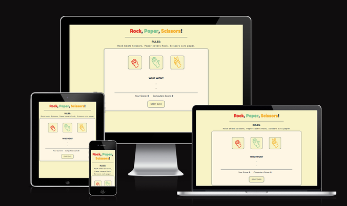
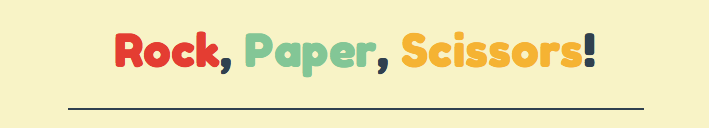
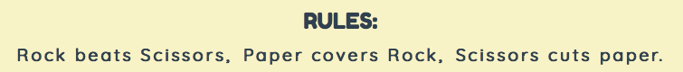
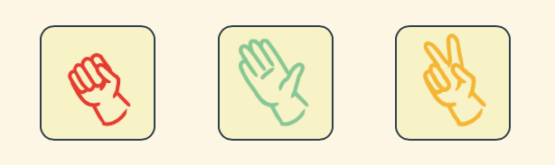
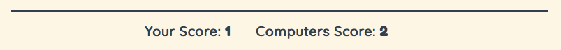

# Rock, Paper, Scissors

A perfect game to occupy ones atention when traveling or simply taking a quick break. 

Rock, paper, scissors is a basic webpage displaying a playable version of the game by the same name. It registers the users choice and match it against a randomly generated oponents choice. The score of the user and computer is registered and the user can choose to continue playing indefinitely or to reset the score count. 

 

## Features

---

### Header

Displays that the purpose of the webpage is the game with corresponding name.

  

### Rules

Introduces how the game works for the user

 

### Option Buttons

Displays the options the user can choose between and registers their choice.

 

### Winner Display

Shows both parties choices and who won the round.

 

### Score Display

Holds the tally of how many times each of the parties has won.

 

### Reset Button

Resets the tally scores. So the user can choose to start over.

 